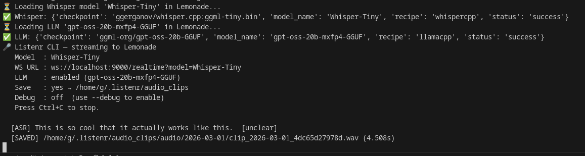

<div align="center">


# Listenr

**Build better speech-to-text and ASR models entirely on your machine.**

Record your voice. Clean it up with local AI. Fine-tune a Whisper model. Deploy something that's actually yours.

<a href="https://quickthoughts.ca/posts/listenr-asr-training-data-problem/">Walkthrough</a> &nbsp;|&nbsp;
<a href="docs/setup.md">Setup</a> &nbsp;|&nbsp;
<a href="docs/configuration.md">Configuration</a> &nbsp;|&nbsp;
<a href="docs/recording.md">Recording</a> &nbsp;|&nbsp;
<a href="docs/troubleshooting.md">Troubleshooting</a>

<a href="https://lemonade-server.ai" target="_blank" rel="noopener">
  
</a>

</div>

---



## How it works

1. **Create good data** - Use Listenr to record and collect natural speech with domain-specific vocabulary that generic models miss.
2. **Process & improve** - Pipe it through [Lemonade](https://lemonade-server.ai) or any OpenAI-compatible provider to transcribe with Whisper and automatically correct grammar, punctuation, and homophones using a local LLM.
3. **Fine-tune & deploy** - Use Listenr to build train/dev/test splits and fine-tune a Whisper model with LoRA. Merge the adapter into a self-contained model you can deploy.

Everything stays local - no audio, text, or weights ever leave on your machine.

## Get started

**Install Lemonade and pull models:**

Lemonade guide: [lemonade-server.ai/docs/guide/install](https://lemonade-server.ai/docs/guide/install/)

```bash
# after installing locally, download default models
lemonade pull Whisper-Base
lemonade pull gpt-oss-20b-mxfp4-GGUF
```


**Install Listenr and start recording:**
```bash
git clone https://github.com/Rebreda/listenr
cd listenr
uv pip install -e .
uv run listenr          # start recording
```

**Once you have recordings, process & fine-tune:**
```bash
# Build train/dev/test splits from your manifest
uv run listenr-build-dataset --format hf

# Fine-tune Whisper (see docs/finetune-amd.md for AMD GPUs)
podman compose run --rm finetune

# Merge the LoRA adapter into a standalone model
podman compose run --rm merge

# Test it against your clips
python scripts/test_merged.py --keyword YourDomainWord
```

See [docs/setup.md](docs/setup.md) for full installation details.

## Under the hood

**Recording & transcription** - Listenr streams your microphone to Lemonade's `/realtime` WebSocket in ~85 ms chunks (16 kHz). Lemonade's voice activity detection segments speech, runs Whisper.cpp, and streams back transcripts.

**Auto-correction** - A local LLM cleans up punctuation, grammar, and homophones, producing a higher-quality training corpus than raw Whisper output alone.

**Dataset & fine-tuning** - Listenr saves each utterance as a `.wav` clip and a line in `manifest.jsonl`. One command builds train/dev/test splits in HuggingFace format. Another command fine-tunes any `openai/whisper-*` model using LoRA (works on AMD and NVIDIA GPUs via Podman).

**Deployment** - `listenr-merge` folds the LoRA adapter into a self-contained model that loads with plain `transformers`. No PEFT dependency. Run inference locally or deploy it anywhere.

## Documentation

| Guide | Description |
|---|---|
| [docs/setup.md](docs/setup.md) | Installation, Lemonade Server, microphone setup |
| [docs/configuration.md](docs/configuration.md) | Full `config.ini` reference, VAD tuning, available models |
| [docs/recording.md](docs/recording.md) | CLI usage, how recording works, batch transcription |
| [docs/dataset.md](docs/dataset.md) | Building train/dev/test splits, CSV and HF formats |
| [docs/finetune-amd.md](docs/finetune-amd.md) | Fine-tuning Whisper on AMD GPU via ROCm + Podman, merging, and inference testing |
| [docs/troubleshooting.md](docs/troubleshooting.md) | Common errors and fixes |

## Acknowledgments

- [Lemonade Server](https://lemonade-server.ai) - unified local inference API
- [whisper.cpp](https://github.com/ggerganov/whisper.cpp) - fast local ASR
- [llama.cpp](https://github.com/ggerganov/llama.cpp) - fast local LLMs

## License

Mozilla Public License Version 2.0 - see `LICENSE`.
